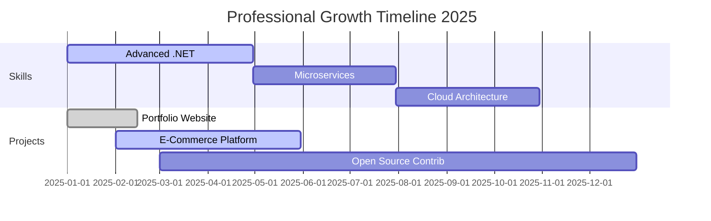

# <div align="center">🚀 Welcome to Efengsi's Code Universe 🚀</div>

<div align="center">
  
<!-- Animated Header with Professional Design -->


<!-- Professional Typing Animation -->
<p align="center">
  
</p>

<!-- Enhanced Profile Counter -->
<p align="center">
  
  
  
</p>

</div>

---

## 🐍 Interactive Contribution Snake Game

<div align="center">
  
<h3>🎮 Watch My Contributions Get Devoured!</h3>

<picture>
  <source media="(prefers-color-scheme: dark)" srcset="https://raw.githubusercontent.com/Fengsii/Fengsii/output/github-contribution-grid-snake-dark.svg">
  <source media="(prefers-color-scheme: light)" srcset="https://raw.githubusercontent.com/Fengsii/Fengsii/output/github-contribution-grid-snake.svg">
  
</picture>

<p><i>🔄 Updates automatically every 12 hours</i></p>

</div>

---

## 👨‍💻 Professional Profile

<table width="100%">
<tr>
<td valign="top" width="50%">

### 🎯 **About Me**

```yaml
Name: Efengsi Rahmanto Zalukhu
Role: Junior Web Developer
Specialization: .NET Development & Backend
Location: Indonesia 🇮🇩
Experience: Full-Stack Development
Current Focus: Scalable Web Applications
```

### 💼 **Professional Focus**
- 🏗️ **Architecture**: Clean Code & SOLID Principles
- 🔧 **Backend**: .NET Core, ASP.NET, Web APIs
- 🎨 **Frontend**: Modern JavaScript, React, Vue.js
- 📊 **Database**: PostgreSQL, MySQL, Entity Framework
- ☁️ **DevOps**: Git, Docker, CI/CD Pipelines

</td>
<td valign="top" width="50%">

### 📈 **Current Status**


### 🎯 **2025 Objectives**
- [ ] 🚀 Master Microservices Architecture
- [ ] 📚 Contribute to 15+ Open Source Projects  
- [ ] 🏆 Build Production-Ready Applications
- [ ] 📝 Share Knowledge Through Tech Blogs
- [ ] 🌟 Mentor Junior Developers


</td>
</tr>
</table>

---

## 🛠️ Technology Stack & Expertise

<div align="center">

### 💻 **Core Technologies**
<p>
  
</p>

### 🔧 **Development Tools**
<p>
  
</p>

### 🗄️ **Databases & Cloud**
<p>
  
</p>

### 🌐 **Web Technologies**
<p>
  
</p>

</div>

---

## 📊 Performance Analytics & Statistics

<div align="center">


</div>

---

## 🏆 Achievements & Recognition

<div align="center">


</div>

<div align="center">
<table>
<tr>
<td align="center" width="33%">

**🔥 Contribution Streak**  


</td>
<td align="center" width="33%">

**⭐ Total Stars Earned**  


</td>
<td align="center" width="33%">

**📦 Total Repositories**  


</td>
</tr>
</table>
</div>

---

## 💻 Weekly Development Breakdown

<div align="center">

<!--START_SECTION:waka-->
```text
💻 This Week I Spent My Time On:

C#           12 hrs 45 mins  ████████████████▓░░░░░░░░   65.4%
JavaScript   4 hrs 30 mins   ██████░░░░░░░░░░░░░░░░░░░   23.1%  
HTML/CSS     1 hr 50 mins    ██▒░░░░░░░░░░░░░░░░░░░░░░    9.4%
SQL          25 mins         ▒░░░░░░░░░░░░░░░░░░░░░░░░    2.1%

🎯 Most Productive Day: Tuesday
📅 Most Active Time: 14:00 - 18:00
🔥 Current Focus: ASP.NET Core Development
```
<!--END_SECTION:waka-->

</div>

---

## 🌐 Professional Network & Contact

<div align="center">

### 📫 **Let's Connect & Collaborate**

<a href="https://linkedin.com/in/Efengsi%20Rahmanto%20Zalukhu">
  
</a>
<a href="mailto:ahmad88989999@gmail.com">
  
</a>
<a href="https://instagram.com/fengsii_rzzz">
  
</a>
<a href="https://github.com/Fengsii">
  
</a>

<p><i>💼 Open for collaboration opportunities and technical discussions</i></p>

</div>

---

## 🎯 Featured Projects & Contributions

<div align="center">

<a href="https://github.com/Fengsii/project-showcase">
  
</a>
<a href="https://github.com/Fengsii/web-portfolio">
  
</a>

</div>

---

## 💡 Professional Insights

<div align="center">

### 📚 **Daily Developer Quote**


### 🎲 **Programming Wisdom**
<details>
<summary>💭 Click for Developer Insights</summary>
<br>

> *"Clean code always looks like it was written by someone who cares."* - Robert C. Martin

**My Development Philosophy:**
- 🎯 **Quality over Quantity**: Write code that lasts
- 🔄 **Continuous Learning**: Technology evolves, so should we  
- 🤝 **Collaboration**: Great software is built by great teams
- 📈 **Growth Mindset**: Every bug is a learning opportunity
- ⚡ **Efficiency**: Automate the boring stuff, focus on creativity

</details>

</div>

---

## 📈 Recent Development Activity

<div align="center">

<!--START_SECTION:activity-->
1. 🚀 **Deployed** new ASP.NET Core API to production
2. 🔧 **Refactored** authentication system in [web-app](https://github.com/Fengsii/web-app)
3. 📝 **Documented** REST API endpoints and usage examples
4. 🐛 **Fixed** critical database connection issue in PostgreSQL
5. ⭐ **Starred** 3 new repositories for learning advanced patterns
<!--END_SECTION:activity-->

</div>

---

## 🎯 Professional Development Roadmap

<div align="center">



</div>

---

## 🌟 Community & Open Source

<div align="center">

### 🤝 **Contributing to the Developer Community**


**Open Source Contributions:**
- 🔄 **15+ Pull Requests** merged across various projects
- 🐛 **25+ Issues** resolved in community repositories  
- 📚 **Documentation** improvements for popular frameworks
- 🎯 **Code Reviews** helping fellow developers

</div>

---

<div align="center">

### 🎨 **Thank You for Visiting!**


<p>
  
  
  
</p>

---

**⭐ Show some love by starring my repositories!**  
*Professional Developer • Clean Code Advocate • Continuous Learner*

*Last updated: June 2025 • Auto-updates every 12 hours via GitHub Actions* 🔄

</div>